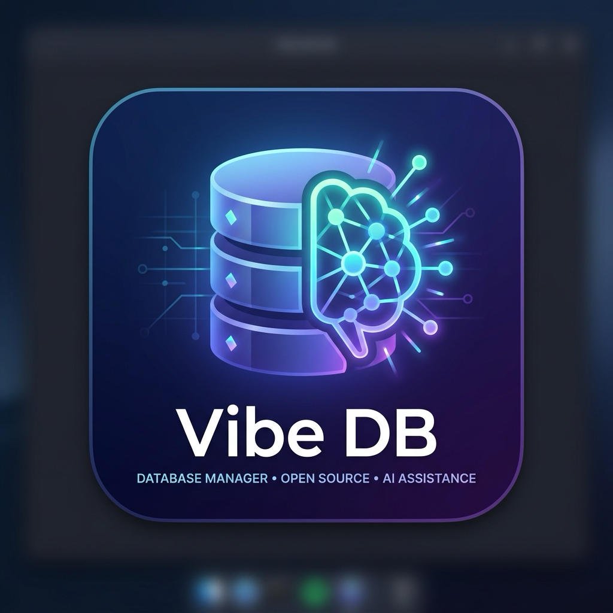
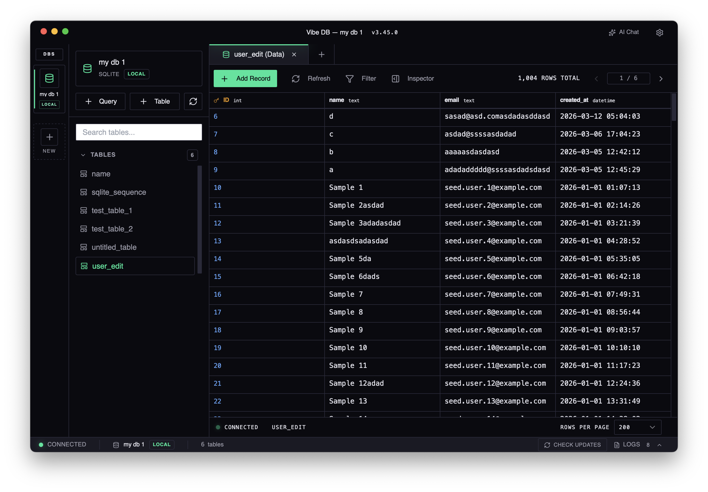

# VibeDB 🇰🇭

<p align="center">
  
</p>

<p align="center">
  <a href="./README.md"><b>🏠 Overview</b></a> &nbsp;•&nbsp;
  <a href="./ROADMAP.md">🗺️ Roadmap</a> &nbsp;•&nbsp;
  <a href="https://github.com/Rithprohos/vibe-db/releases">🚀 Releases</a> &nbsp;•&nbsp;
  <a href="./LICENSE">⚖️ License</a>
</p>

---

A modern, high-performance SQLite database manager built with Tauri v2 and React. Engineered for speed, security, and a premium developer experience.


[](./ROADMAP.md)

## Why VibeDB?

Paid database tools made sense before AI. Now a solo dev with agents can build the same thing in weeks — and give it away free. That's VibeDB.

<p align="center">
  
</p>

## 🛠️ Core Features

- **🚀 High Performance** — Full virtualization (TanStack) and code-splitting across the entire app; browse 10,000+ rows with zero lag.
- **💎 Transactional Editing** — Stage multiple cell edits across different rows and commit them all in a single atomic SQL transaction.
- **🌍 Multi-Engine Ready** — Trait-based abstraction (SQLite active; Turso, Postgres, MySQL coming soon).
- **🏗️ Visual Table Builder** — Create tables with a polished GUI including real-time, syntax-highlighted SQL preview.
- **🔍 Smart Data Filtering** — Visual WHERE clause builder with support for `BETWEEN`, `NOT BETWEEN`, and multiple conditions.
- **🛡️ Encrypted Security** — Credentials stored in a `Stronghold` vault (Argon2id + XChaCha20-Poly1305).
- **✨ Pollinations AI** — Intelligent SQL assistance built right into the query editor.
- **🎨 Premium Themes** — Switch between **Dark**, **Light**, and **Purple Solarized** modes.
- **⌨️ Workflow Mastery** — Multi-tab interface, persistent state, and keyboard-first design (`⌘N`, `⌘T`, `⌘↵`).

## 🚀 Getting Started

```bash
# Clone and install
git clone https://github.com/Rithprohos/vibe-db.git
cd vibe-db
bun install

# Launch in dev mode
bun run tdev

# Build for production
bun run build
bun run tauri build
```

## 🏗️ Architecture

- **Frontend**: React 19 + TypeScript + Zustand + Tailwind CSS
- **Backend**: Rust + Tauri v2 + sqlx (Async SQLite)
- **Editor**: CodeMirror 6 with SQL support
- **State**: Persistent JSON via `tauri-plugin-store`

---

_Crafted with vibe coding and AI assistance. See [ROADMAP.md](./ROADMAP.md) for the journey to v0.3 (Turso Edge Support)._
