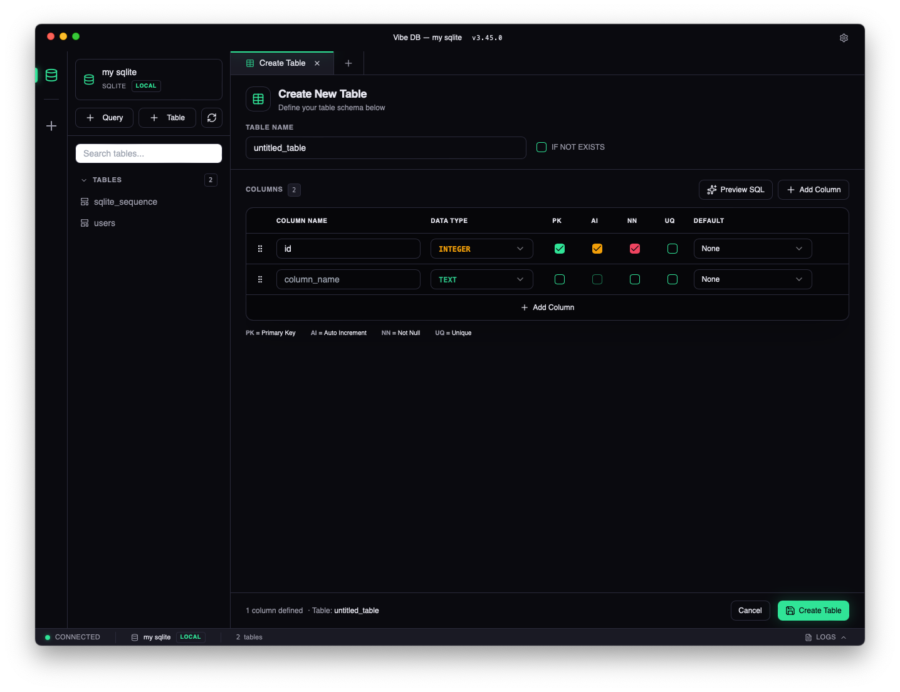

# VibeDB 🇰🇭

<p align="center">
  
</p>

<p align="center">
  <a href="./README.md"><b>🏠 Overview</b></a> &nbsp;•&nbsp;
  <a href="./ROADMAP.md">🗺️ Roadmap</a> &nbsp;•&nbsp;
  <a href="https://github.com/Rithprohos/vibe-db/releases">🚀 Releases</a> &nbsp;•&nbsp;
  <a href="./LICENSE">⚖️ License</a>
</p>

---

A modern, cross-platform SQLite database manager built with Tauri v2 and React.


[](./ROADMAP.md)

## Why VibeDB?

Paid database tools made sense before AI.

Now a solo dev with agents can build
the same thing in weeks — and give it away free.

That's VibeDB.

## Overview

VibeDB is a sleek, high-performance SQLite database management tool designed for developers who appreciate clean interfaces and efficient workflows. Created with AI-assisted development using vibe coding principles.

<p align="center">
  
</p>

<p align="center">
  
</p>

**[🗺️ View Roadmap](./ROADMAP.md)**

## Features

- **Cross-Platform** — Native performance on macOS, Windows, and Linux via Tauri
- **Multi-Engine Architecture** — Extensible database engine system (SQLite now, Turso/PostgreSQL/MySQL coming soon)
- **SQL Query Editor** — Syntax highlighting, autocomplete, and keyboard shortcuts (⌘+Enter to run)
- **Table Browser** — View table structure, browse data, and manage schemas
- **Create Table GUI** — Visual table builder with column types, constraints (PK, AI, NN, UQ), defaults, and SQL preview with syntax highlighting
- **Multi-Tab Interface** — Work with multiple queries and tables simultaneously with persistent state
- **Query AI Assistant** — Powered by Pollinations AI for intelligent query suggestions
- **Dark-First UI** — Easy on the eyes with a carefully crafted dark theme
- **Connection Management** — Save and quickly switch between databases with environment tags (local, testing, development, production)
- **Persistent Storage** — Connection settings stored in a durable JSON file via `tauri-plugin-store` (survives app updates and system cleaners)
- **Query History** — Track executed queries with status and duration
- **Performance Optimized** — Tab limits, result truncation, memoized components for smooth UX

## Tech Stack

| Layer    | Technology                                 |
| -------- | ------------------------------------------ |
| Backend  | Tauri v2 (Rust) + sqlx                     |
| Frontend | React 19 + TypeScript                      |
| Build    | Vite 7                                     |
| Styling  | Tailwind CSS + CSS Variables               |
| State    | Zustand (persisted via tauri-plugin-store) |
| Editor   | CodeMirror 6 (SQL mode)                    |
| AI       | Pollinations AI                            |
| Security | tauri-plugin-stronghold (encrypted vault)  |

## Getting Started

### Prerequisites

- [Node.js](https://nodejs.org/) (v18+)
- [Bun](https://bun.sh/) — Package manager
- [Rust](https://rustup.rs/) — For Tauri backend

### Installation

```bash
# Clone the repository
git clone https://github.com/Rithprohos/vibe-db.git
cd vibe-db

# Install dependencies
bun install

# Start development server (frontend only)
bun run dev

# Start full Tauri app (first compile ~2-3 min)
bun run tauri dev
# or use the alias
bun run tdev
```

### Build for Production

```bash
# Type check and build frontend
bun run build

# Build Tauri app for distribution
bun run tauri build
```

## Project Structure

```
vibe-db/
├── src/                    # React frontend
│   ├── components/         # UI components
│   │   ├── ui/            # shadcn/ui primitives
│   │   ├── QueryEditor.tsx
│   │   ├── TableView.tsx
│   │   ├── Sidebar.tsx
│   │   └── ...
│   ├── store/             # Zustand state
│   ├── lib/               # Utilities & Tauri wrappers
│   └── index.css          # CSS variables & theme
├── src-tauri/             # Rust backend
│   └── src/
│       ├── lib.rs         # Tauri commands & state
│       ├── main.rs        # Entry point
│       └── engines/       # Database engine abstraction
│           ├── mod.rs     # Engine registry
│           ├── traits.rs  # DatabaseEngine trait
│           ├── types.rs   # Shared types
│           └── sqlite.rs  # SQLite implementation
└── package.json
```

## Architecture

### Database Engine System

VibeDB uses a trait-based engine abstraction for multi-database support:

```rust
#[async_trait]
pub trait DatabaseEngine: Send + Sync {
    async fn connect(&self, config: &ConnectionConfig) -> EngineResult<()>;
    async fn disconnect(&self);
    async fn list_tables(&self) -> EngineResult<Vec<TableInfo>>;
    async fn get_table_structure(&self, table_name: &str) -> EngineResult<Vec<ColumnInfo>>;
    async fn execute_query(&self, query: &str) -> EngineResult<QueryResult>;
    async fn get_table_row_count(&self, table_name: &str) -> EngineResult<i64>;
    async fn create_database(&self, path: &str) -> EngineResult<String>;
}
```

**Current engines:** SQLite (via sqlx)

**Planned:** Turso, PostgreSQL, MySQL

See [ROADMAP.md](./ROADMAP.md) for details.

## Keyboard Shortcuts

| Shortcut         | Action        |
| ---------------- | ------------- |
| `⌘/Ctrl + Enter` | Execute query |

## Development

### Commands

```bash
bun run dev          # Frontend dev server (port 1420)
bun run tauri dev    # Full app with hot reload
bun run build        # Production build
bun run preview      # Preview production build
```

### Testing

#### Rust Backend Tests

```bash
cd src-tauri
cargo test           # Run all Rust unit tests
cargo test engines   # Run engine tests only
cargo test sqlite    # Run SQLite tests only
cargo test -- --nocapture  # Show println output
```

#### Frontend Tests

```bash
# Coming soon - Vitest setup planned
bun vitest run       # Run frontend tests (when added)
```

### Code Style

- TypeScript strict mode
- Functional React components with hooks
- CSS variables for theming (no hardcoded colors)
- `kebab-case` for files, `PascalCase` for components

## Security

VibeDB uses a two-tier storage architecture for security:

| Storage          | Purpose                                    | Technology                                                                |
| ---------------- | ------------------------------------------ | ------------------------------------------------------------------------- |
| **App Settings** | Connection names, paths, tags, preferences | `tauri-plugin-store` — durable JSON file on disk                          |
| **Secure Vault** | Passwords, tokens, API keys (future)       | `tauri-plugin-stronghold` — Argon2id + XChaCha20-Poly1305 encrypted vault |

### Key Security Features

- **No localStorage** — All persistent data is stored in native files, not in browser storage that can be wiped by system cleaners
- **Encrypted credentials** — When remote database engines (Turso, PostgreSQL, MySQL) are added, passwords will be stored in an encrypted Stronghold vault
- **CSP** — Content Security Policy planned for production builds
- **Connection tagging** — Environment labels (local/testing/development/production) help prevent accidental operations on production databases

See [ROADMAP.md](./ROADMAP.md) for security hardening plans.

## Built With

- [Tauri](https://tauri.app/) — Build smaller, faster, and more secure desktop apps
- [sqlx](https://github.com/launchbadge/sqlx) — Async SQL with compile-time checking
- [React](https://react.dev/) — A JavaScript library for building user interfaces
- [Tailwind CSS](https://tailwindcss.com/) — A utility-first CSS framework
- [CodeMirror](https://codemirror.net/) — Versatile text editor in the browser
- [Pollinations AI](https://pollinations.ai/) — AI-powered query assistance

## License

MIT License — feel free to use this project for your own purposes.

---

_Crafted with vibe coding and AI assistance._
